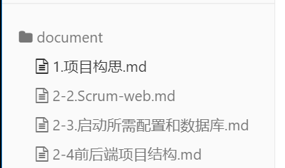
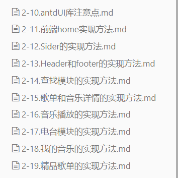

# 1.项目构思

#### 1.项目介绍/文档说明

本项目是一个在线音乐试听和资源共享网站，

通过资源共享论坛和网站中的音乐圈子功能，促使用户主动上传音乐等资源实现共享，营造各种不同文化圈子的良好交流氛围，实现产品价值

第一阶段：优先实现，app和web端的作为音乐播放器的基本功能

##### 文档说明

本系列文档

 **1到2-4是web端项目设置及其启动的配置 是最重要的**

**2-10以后是各个模块的实现方法的说明** **比较重要**

2-5到2-10 项目编写过程中遇到的一些问题 不重要

#### 2.项目流程图

#### 3.项目技术栈

本项目是采用跨平台解决方案JS+react native 进行安卓端开发的，

是一个多页面应用，导航器采用 react navigation，用dva进行状态管理

web端网站使用react，后端采用Spring boot，mybatis, Spring security 数据库为MySQL

#### 4.App具体功能模块

1. ##### 首页（）

   首页轮播图  

   标签导航器（首尾部）

   自定义顶部标签组件功能  

   上拉刷新功能

   下拉加载功能

   网络请求和数据映射

   音乐列表

   

2. ##### 账号管理模块

   

3. ##### 用户个人中心

   我的模块

   

4. ##### 登陆页

   

5. ##### 音乐详情页

   

6. ##### 频道模块

   频道信息tab模块

   频道信息模块

   动态生成标签导航器和model

   标题栏右上角按钮

   类别的拖拽功能

   

7. ##### 音乐播放模块

   音乐播放功能

   弹幕功能

   底部功能按钮

   

8. ##### 历史播放模块

   历史播放

   

9. ##### 猜你喜欢模块

   

10. ##### 发现音乐模块

#### 5.网站具体功能模块

1. ##### 首页（）

   首页轮播图  

   自定义顶部标签组件功能  

   新碟上架

   榜单模块

   电台信息模块

   网络请求和数据映射

   音乐列表

   查找模块

   精选歌单

   

2. ##### 账号管理模块

   后台用户管理模块

   后台角色管理模块

   后台歌曲审核模块

   后台权限管理模块

   

3. ##### 用户个人中心

   我的模块

   

4. ##### 登陆页

   

5. ##### 精选歌单

   歌单详情

   歌曲详情

6. ##### 频道模块

   频道信息tab模块

   频道信息模块

   标题栏右上角按钮

   

7. ##### 音乐播放模块

   音乐播放功能

   弹幕功能

   底部功能按钮

   音乐播放的控制功能

8. ##### 历史播放模块

   历史播放

   

   ##### 
