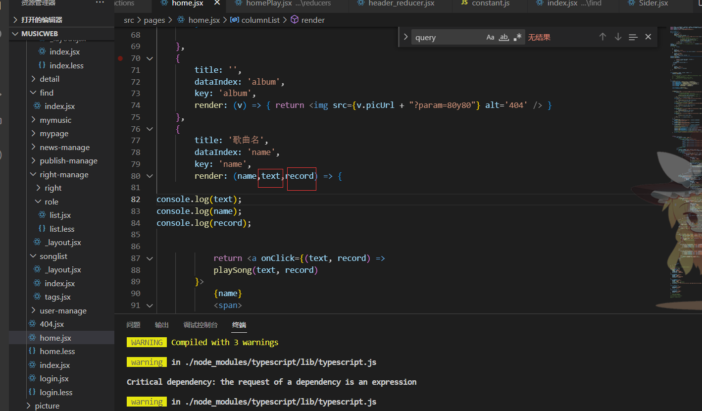

**获取antd table 行数据参数不一定是record可能是text**

**Table-列render中的三个参数**

antd官方文档对于render的描述是这样的

| 1    | Function(text, record, index) {} |
| ---- | -------------------------------- |
|      |                                  |

我们习惯实现时也声明为这样的三参函数，但是实际上一定要这样吗？不是的。

比如，列没有配置dataIndex，在实际的render中，我们可以这样

| 1    | render: (record) =>this.props.isHidden? record.a : record.b) |
| ---- | ------------------------------------------------------------ |
|      |                                                              |

antd的UI组件都是封装了RC组件库，更多只是修改了UI，column渲染逻辑主要在rc-table的源码中。

**源码中逻辑是这样的，在获取列单元格render函数的第一个参数值的时候，会先用dataIndex去拿，假如dataIndex不存在且不是number基本类型时，会返回当前行记录。**