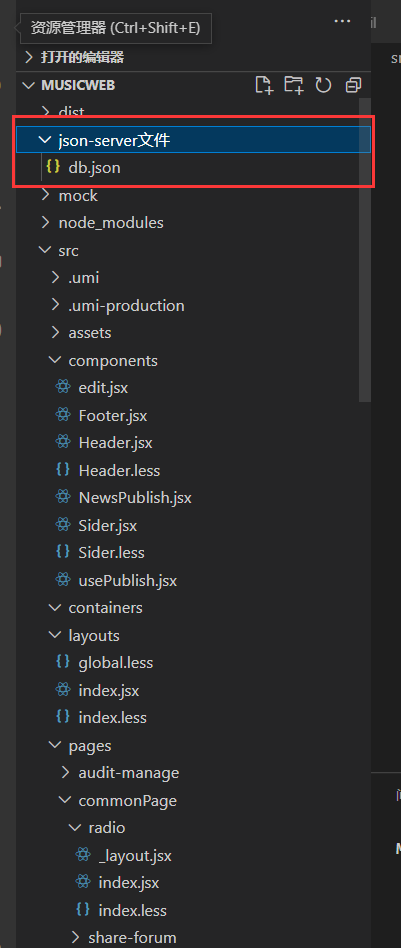

##### 前端框架搭建

借鉴尚硅谷后台管理系统，初步搭建路由和页面就行

用户数据 权限可以先使用项目内jsonserver文件

umi框架是约定式路由，不用自己配，注意文件夹名称和嵌套关系就行

拦截器 src/wrappers/Auth

```
import React, { useState, useEffect } from 'react';
import { Redirect, useLocation } from 'umi';

// 该组件用于权限判断


const Auth = (props) => {
  const [backRouteList, setbackRouteList] = useState([])
  const location = useLocation()

  const isLogin = localStorage.getItem('token')
  // 下面是jsonserver的数据获取方式
  // const { role: { rights } } = JSON.parse(localStorage.getItem('token'))
  // 下面是从自己数据库获取
  const { rights  } = JSON.parse(localStorage.getItem('token'))
  // 下面是jsonserver的数据获取方式
  // console.log(rights)
  // rights.checked.push('/')
  // if (isLogin) {
  //   if (rights.checked.includes(location.pathname)) {
  //     return <div>{props.children}</div>;
  //   }
  //   return <Redirect to="/404" />;
  // }
  // return <Redirect to="/login" />;
  
  // 下面是从自己数据库获取
  console.log(rights)
  rights.push('/')
  if (isLogin) {
    if (rights.includes(location.pathname)) {
      return <div>{props.children}</div>;
    }
    return <Redirect to="/404" />;
  }
  return <Redirect to="/login" />;

};

export default Auth;
```





#### 歌曲/歌单的<li>实现动态显示

home最重要的就是歌曲歌单的<li>如何实现动态显示，这一块代码在很多模块中都会用到

首先，页面初始渲染发请求并用useState([])存入list，如下，

注意：useEffect（）第二个参数为 []就行，有参数的话会根据这个参数变化不断发请求

```
 	const [musiclist, setmusiclist] = useState([])
    const [SongListId, setSongListId] = useState([])
    const [GuessSongList, setGuessSongList] = useState([])
    const [NewSongList, setNewSongList] = useState([])
    const [JapenSongList, setJapenSongList] = useState([])
    const [SongList, setSongList] = useState([])
    const [songId1, setsongId1] = useState([])
    const [songId2, setsongId2] = useState([])


    const history = useHistory()
    const songIdContainer = useRef()

useEffect(() => {
        axios.get('http://localhost:3000/top/playlist?order=hot').then(
            res => {
                /*   console.log(res);
                  console.log(res.data.playlists);
                  console.log(res.data.playlists[0].name); */

                setmusiclist(res.data.playlists);
                /* setsongCount(res.data.playlists.name); */
            }
        ).catch(((e) => { console.log(e); }))

        axios.get('http://localhost:3000/top/playlist?cat=ACG').then(
            res => {

                setGuessSongList(res.data.playlists);
            }
        ).catch(((e) => { console.log(e); }))

        // 新歌上架的接口关了，先用一般的接口
        axios.get('http://localhost:3000/top/playlist?order=日语').then(
            res => {

                setNewSongList(res.data.playlists);
            }
        ).catch(((e) => { console.log(e); }))


        // ### 日语新歌榜
        axios.get('http://localhost:3000/top/song?type=8').then(
            res => {
                /* console.log(res); */
                setJapenSongList(res.data.data);
            }
        ).catch(((e) => { console.log(e); }))

        // ### 新歌榜
        axios.get('http://localhost:3000/top/song?type=0').then(
            res => {

                setSongList(res.data.data);

            }
        ).catch(((e) => { console.log(e); }))

    }, [])
   
```

然后return html元素 这里其实可以封装成组件，但是我是边学边做没法考虑周全

```
<Divider orientation="left" style={{ margin: '0px' }}>热门推荐</Divider>
                <div style={{ textAlign: 'right' }}><a onClick={toSongList} >更多精选歌单...</a></div>
                <ul className="main-list">
                    {
                        musiclist.slice(0, 10).map((item, index) => {
                            return <li style={{
                                display: 'inline-block', width: '190px',
                                height: '200px', paddingLeft: '40px'
                            }}>
                                <div>
                                    <div
                                        key={item.index}
                                        style={{
                                            width: '140px',
                                            height: '140px'
                                        }}
                                        
                                        className="song_item"
                                        songname={item.name}
                                        songid={item.id}
                                        
                                    >

                                        <a  onClick={(e) => { toSongListDetail(item.id, item.name) }}>
                                            

                                        </a>

                                    </div>

                                    <div>
                                        <p><a onClick={(e) => { toSongListDetail(item.id, item.name) }}>{item.name}</a></p>
                                    </div>

                                </div>
                            </li>
                        })
                    }
                </ul>
```

注意，要musiclist.slice(0, 10).map（）可以先截再遍历，不然假如后端没做分页的话，数据量太大，页面会崩溃


#### 榜单

```
 const toSongDetail = (record) => {
        // console.log(text);
        // console.log(value);
        console.log(record);
        
        store.dispatch({type:DISPATH_SONG_ID,data:record.id})
        history.push('/commonPage/song-detail')

    }
```

```

                <Divider orientation="left">榜单</Divider>


                <div style={{ width: '45%', float: 'left' }}>
                    <p>日本歌曲榜  </p>
                    <Table /* rowKey={record => record.id} */
                     columns={columnList} 
                     dataSource={JapenSongList}
                     onRow={(record, index) => {
                        return {
                          onClick: () => {
                            console.log(record); // 获取每一行数据
                            toSongDetail(record)
                          }
                        };
                      }}
                     />

                </div>
                <div style={{ width: '45%', float: 'right' }}>

                    <p>新歌排行榜  </p>
                    <Table /* rowKey={record => record.id} */ 
                    columns={columnList} 
                    dataSource={SongList}
                    onRow={(record, index) => {
                        return {
                          onClick: () => {
                            console.log(record); // 获取每一行数据
                            toSongDetail(record)
                          }
                        };
                      }}
                    />

                </div>
```

榜单模块需要注意的地方是，

onRow={(record, index) => {
                        return {
                          onClick: () => {
                            console.log(record); // 获取每一行数据
                            toSongDetail(record)
                          }
                        };

有时不是传record而是传text，ant design官方文档写的很不清楚，很烦


另外，点击事件我直接自己new了个action，传给store交给reducer，正常来说要用action creator的

 store.dispatch({type:DISPATH_SONG_ID,data:record.id})


还有样式一般是需要单独写个文件然后导出的，但是有些样式和框架本身样式冲突，只能写行内或者单独写文件加！，只能等待以后有时间优化


#### layout组件

layout组件中进行了下初步路径判断

注意umi中要用 <Layout>包裹组件就行


```

import React, { useState, useEffect } from 'react';
import { Layout, Button, Menu, Space, theme, Breadcrumb } from 'antd';
import { LaptopOutlined, NotificationOutlined, UserOutlined } from '@ant-design/icons';
import Sider from '../components/Sider'
import Header from '../components/Header'
// import Footer from '../components/Footer'
import './index.less'
import NProgress from 'nprogress'
import 'nprogress/nprogress.css'
import { Provider } from 'react-redux'


const { Content, Footer } = Layout;


export default function index(props) {

  NProgress.start();
  useEffect(() => {
    NProgress.done();
  })


  if (
    props.location.pathname === '/login' ||
    props.location.pathname === '/login/' ||
    props.location.pathname === '/news' ||
    props.location.pathname === '/news/' ||
    props.location.pathname.includes('/detail')

  ) 
  {
    return <div>{props.children}</div>;
  }

  /*  const {
     token: { colorBgContainer },
   } = theme.useToken();
  */
  return (
   
      <Layout>


        <Header className="header"></Header>


        <Layout>
          <Sider></Sider>
          <Layout style={{ padding: '0 24px 24px' }}>
            <Content
              className="site-layout-background"
              style={{
                margin: '24px 16px',
                padding: 24,
                minHeight: 280,
                overflow: 'auto'
              }}
            >
              {props.children}
            </Content>
          </Layout>
        </Layout>

        {/* <Footer
        style={{
          margin: '24px 16px',
          overflow: 'visible',
          textAlign: 'center',
        }}
      >
        Ant Design ©2018 Created by Ant UED
      </Footer> */}


      </Layout>

  )
}


```

