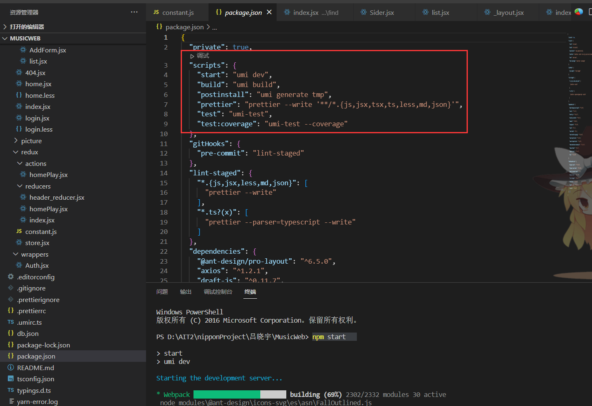
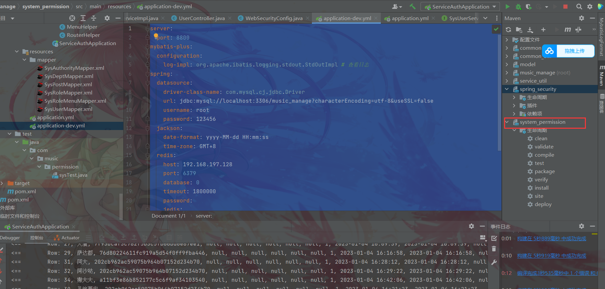
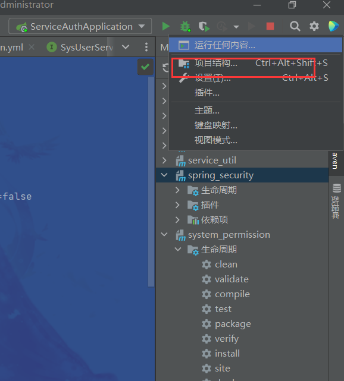
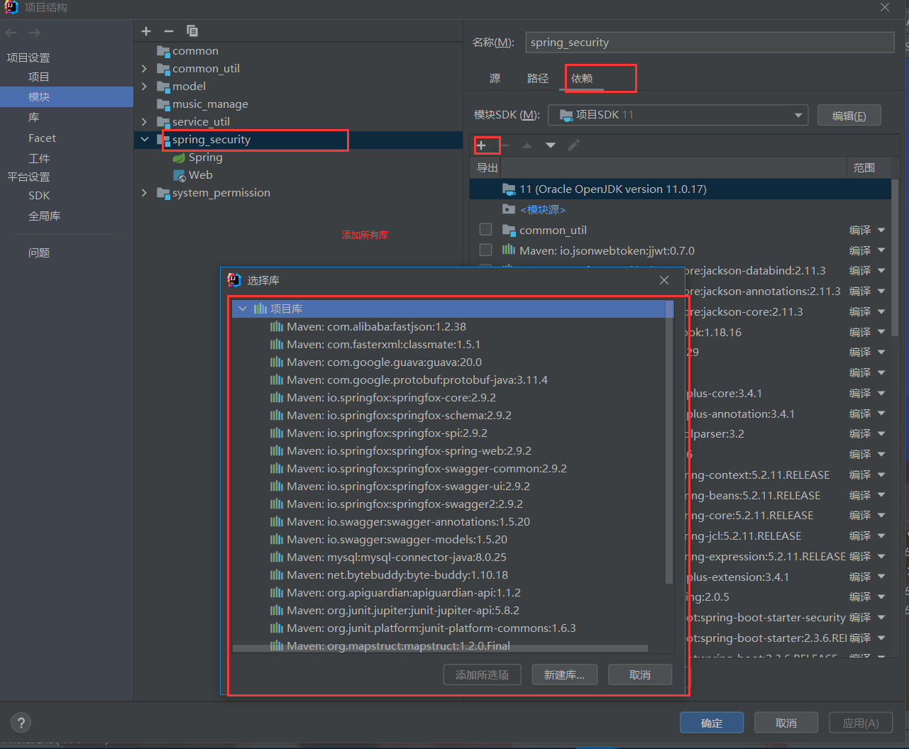
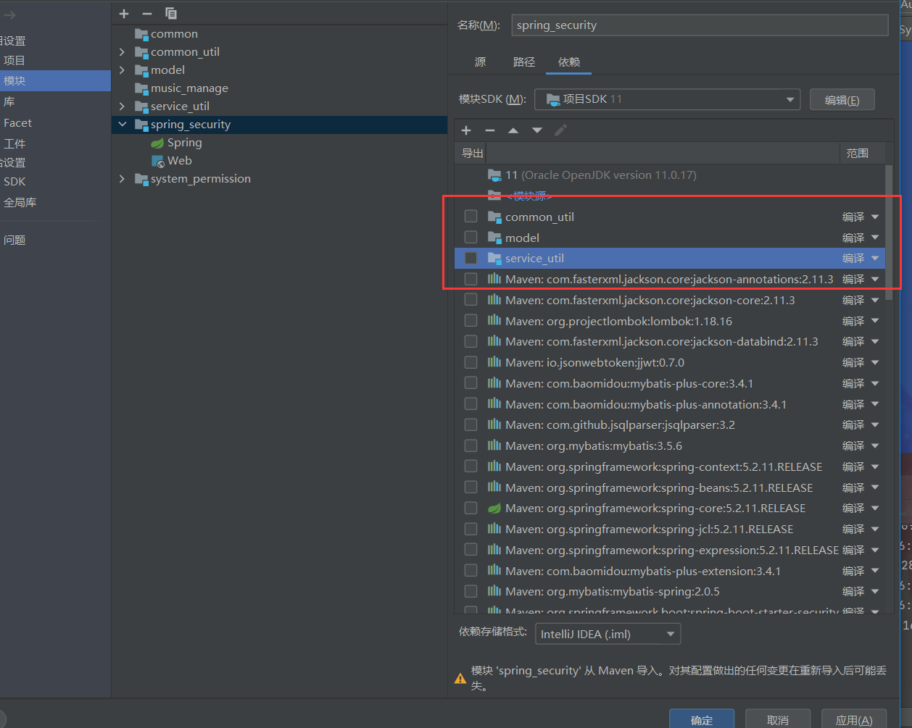
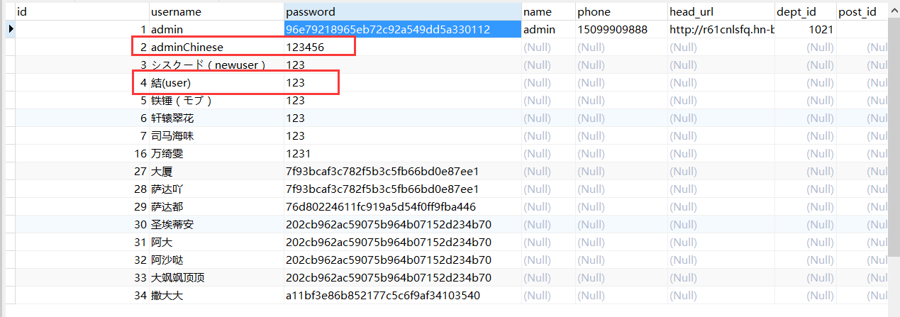
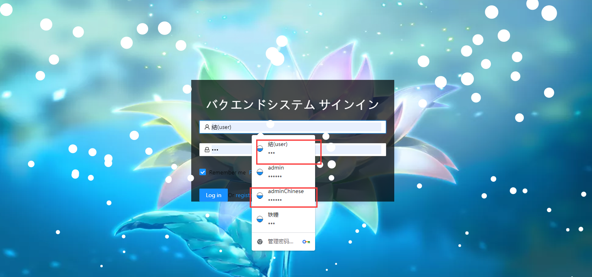
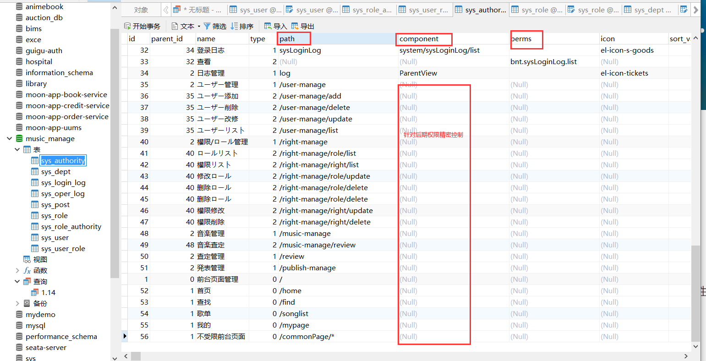

### 前端启动

```
1.初始化库
npm install

2.启动 
npm start/umi dev
```





### 后端启动

#### 音乐资源请求相关的官方开源后台

NeteaseCloudMusicApi 网易云音乐 NodeJS 版 API

https://neteasecloudmusicapi.js.org/#/?id=neteasecloudmusicapi

```
[安装](https://neteasecloudmusicapi.js.org/#/?id=安装)
$ git clone git@github.com:Binaryify/NeteaseCloudMusicApi.git

$ npm install

运行
$ node app.jsb
服务器启动默认端口为 3000
```

本项目所用端口即默认端口为 3000


#### 用户认证，权限管理相关接口的后台 

music_manage下载完源码，直接刷maven依赖，启动

具体端口占用情况如下：

```
server:
  port: 8800
mybatis-plus:
  configuration:
    log-impl: org.apache.ibatis.logging.stdout.StdOutImpl # 查看日志
spring:
  datasource:
    driver-class-name: com.mysql.cj.jdbc.Driver
    url: jdbc:mysql://localhost:3306/music_manage?characterEncoding=utf-8&useSSL=false
    username: root
    password: 123456
  jackson:
    date-format: yyyy-MM-dd HH:mm:ss
    time-zone: GMT+8
  redis:
    host: 192.168.197.128
    port: 6379
    database: 0
    timeout: 1800000
    password:
    jedis:
      pool:
        max-active: 20 #最大连接数
        max-wait: -1    #最大阻塞等待时间(负数表示没限制)
        max-idle: 5    #最大空闲
        min-idle: 0     #最小空闲
```


#### 注意：

下图子模块的pom文件依赖，有时会有问题无法下载，直接手动添加3个子模块和所有库就行










### 登陆

推荐用以下两个角色登陆 结是普通用户角色，adminchinese是最高管理员






#### 数据库文件及其设计思路


相关建表sql在文件目录database中


设计思路：

用户角色权限，分别建立3张表，用户角色，角色权限之间分别设计两张中间表，实现比较好的拓展性，降低耦合度

其中，关于权限表的权限设置，初步只控制页面，但也有后期进行精密权限控制的字段，提升权限控制的粒度




此外，权限列表，除了id2的系统管理父节点  id35以后才是本项目的权限，35之前是以前项目的数据