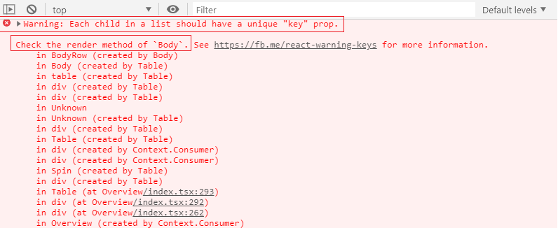
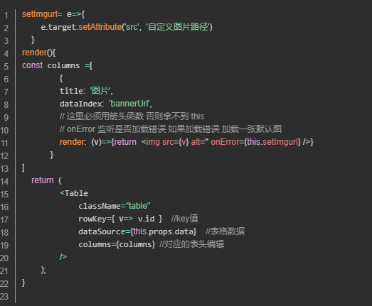
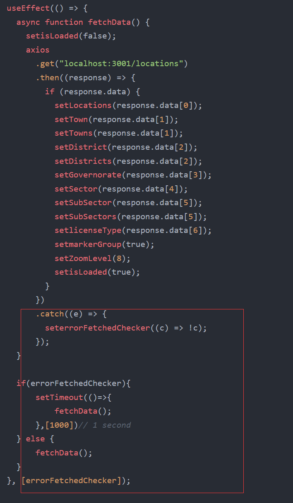

# antd key报错 Each child in a list should have a unique “key“ prop.

解决方式：官方给 Table 组件提供了一个 `rowKey` 属性，用于给表格的每一行设定一个 key 值

最终的解决方案出来了，不过还是不能解决树形结构的数据如果存在相同id的情况。按理讲，是不会出现这种情况的，不然父级id相同，子级就无法找到父级了。

   <Table rowKey={(record) => {record =>record.children && record.children.length ? record.id : record.id + Math.random()}} columns={columns} dataSource={musiclist} />

table图片不显示

## 列表数据显示不全

请求错误处理 

只提取错误信息，不进行请求重发

