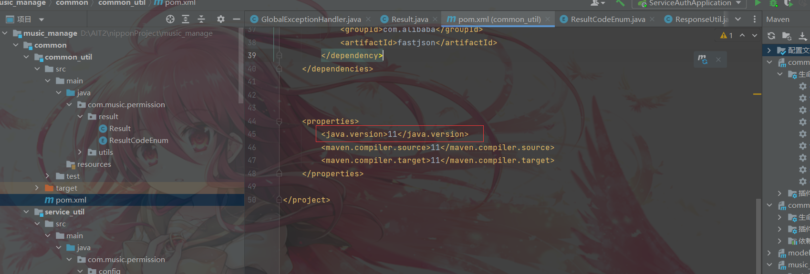
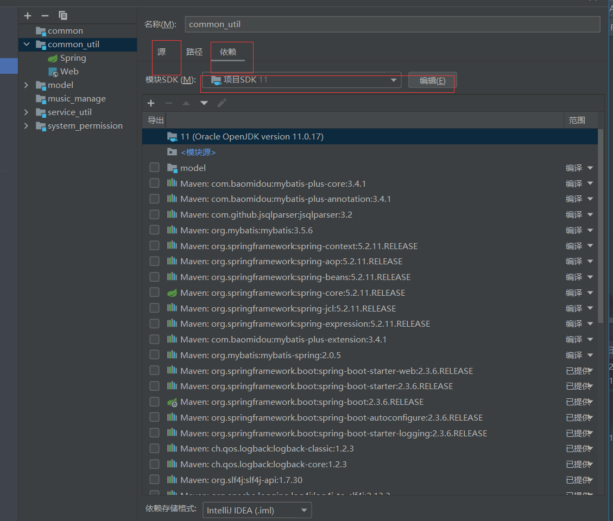
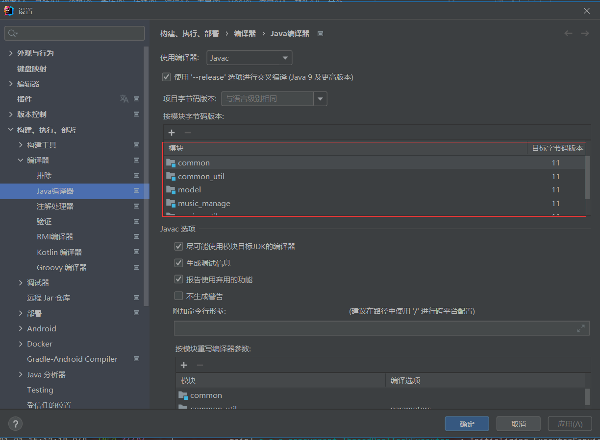

### 多模块项目依赖问题


项目是多模块的，模块A，模块B。模块A和B是同一个父pom下的兄弟模块。模块B依赖模块A，但是模块A又不需要部署到[maven](https://so.csdn.net/so/search?q=maven&spm=1001.2101.3001.7020)仓库。当执行mvn dependency:tree的时候就会报下面的错误:

Could not resolve dependencies for project **moduleA**: The following artifacts could 
not be resolved: moduleA: Failure to find **moduleA 1.0.0**  in /nexus/content/groups/public/ was 
cached in the local repository,resolution will not be reattempted until 
the update interval of public has elapsed or updates are forced .


解决方法就是：先在父pom的目录下，执行mvn install。然后在到子目录执行mvn dependency:tree就可以了。


不同子模块引入其他模块时，注意引入模块的《groupId》是不变的，groupId并非按照项目路径填写

```
<dependency>
    <groupId>org.example.music_manage</groupId>
    <artifactId>model</artifactId>
    <version>1.0-SNAPSHOT</version>
</dependency>
```


artifactId/groupId的基本概念：

groupId和artifactId被统称为“坐标”，是为了保证项目的唯一性而提出的。如果你要把项目弄到[maven](https://so.csdn.net/so/search?q=maven&spm=1001.2101.3001.7020)仓库中，查找的时候就必须用groupId和atifactId去查找。

groupId一般分为多段。这里我只说两段：

第一段为域：域又分为org、com、cn等等许多，其中org为非营利组织，com为商业组织。

第二段为公司名称：如apache、alibaba、baidu等

第二段为项目名：如shardingsphere


```
<dependency>
  <groupId>org.apache.shardingsphere</groupId>
  <artifactId>sharding-core-parse</artifactId>
  <version>4.0.0-RC3</version>
  <type>pom</type>
</dependency>
```


# IDEA报错：java: 警告: 源发行版 11 需要目标发行版 11










有时候要改。iml文件