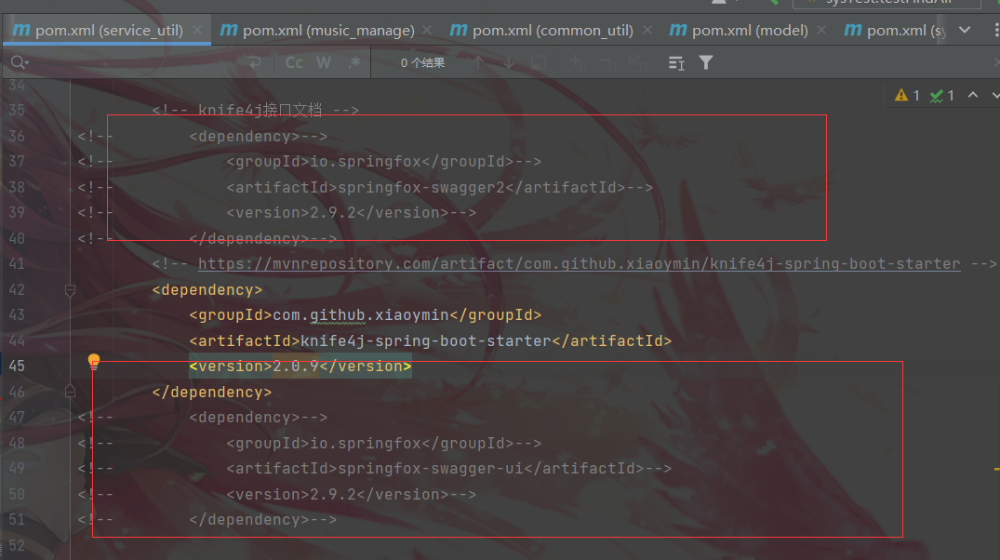

配置SpringBoot使用Knife4j无法引入@EnableSwagger2WebMvc注解, 报错以下问题
`Cannot resolve symbol 'EnableSwagger2WebMvc'`

1. 注释掉！！！！以下的依赖
2. 

只使用，只留下以下的依赖
        <dependency>
            <groupId>com.github.xiaoymin</groupId>
            <artifactId>knife4j-spring-boot-starter</artifactId>
            <version>2.0.9</version>
        </dependency>
