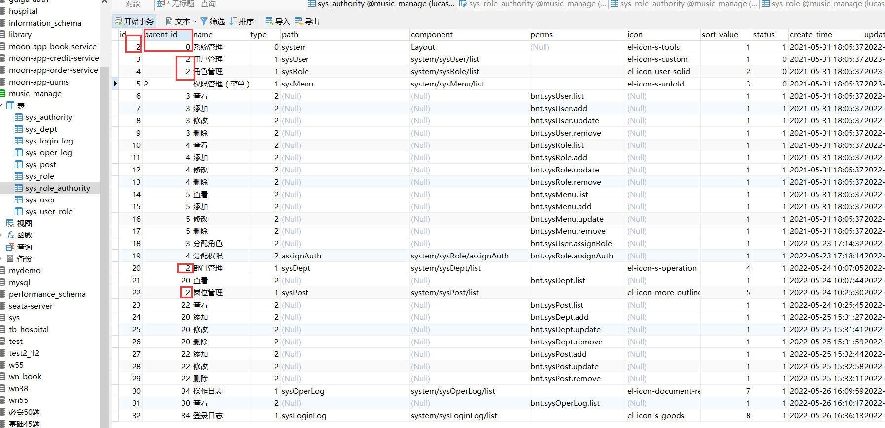

```

import java.util.ArrayList;
import java.util.List;
//封装嵌套数组的返回数据集工具类
public class MenuHelper {

    //构建树形结构
//    传入获取所有菜单（……）的list
    public static List<SysMenu> bulidTree(List<SysMenu> sysMenuList) {
        //创建集合封装最终数据
        List<SysMenu> trees = new ArrayList<>();
        //遍历所有菜单集合
        for (SysMenu sysMenu:sysMenuList) {
            //找到递归入口，parentid=0
            if(sysMenu.getParentId().longValue()==0) {
                trees.add(findChildren(sysMenu,sysMenuList));
            }
        }
        return trees;
    }

    //从根节点进行递归查询，查询子节点
    // 判断 id =  parentid是否相同，如果相同是子节点，进行数据封装
    private static SysMenu findChildren(SysMenu sysMenu, List<SysMenu> treeNodes) {
        //数据初始化
        sysMenu.setChildren(new ArrayList<SysMenu>());
        //遍历递归查找
        for (SysMenu it:treeNodes) {
            //获取当前菜单id
//            String id = sysMenu.getId();
//            long cid = Long.parseLong(id);
            //获取所有菜单parentid
//            Long parentId = it.getParentId();
            //比对 查看sysMenu数据行有没有子数据行
            if(Long.parseLong(sysMenu.getId())==it.getParentId()) {
                if(sysMenu.getChildren()==null) {
                    sysMenu.setChildren(new ArrayList<>());
                }
//                在查看it数据行有没有子数据行，通过递归不断调用穷尽子数据行
                sysMenu.getChildren().add(findChildren(it,treeNodes));
            }
        }
        return sysMenu;
    }
}
```

