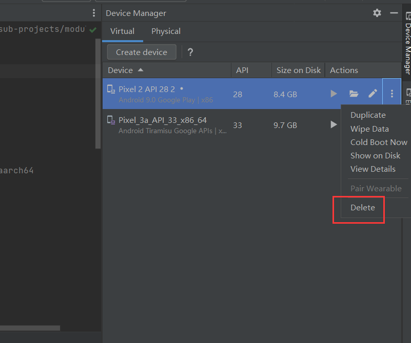
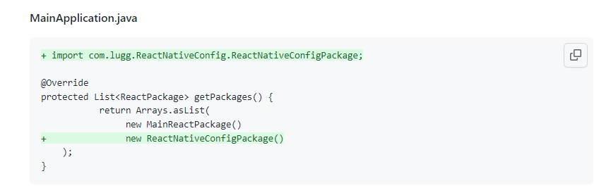
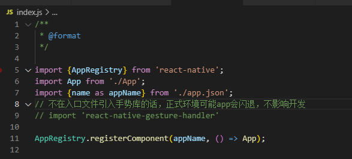

# 


#### Android Studio

##### Execution failed for task ':app:installDebug'.

解决办法：

1.输入adb devices 查看当前设备列表及其状态。

```csharp
          第一次执行此命令会先杀掉adb进程：adb server is out of date, killing....

          等待一会，如果提示，*daemon started sucessfully,那么继续  adb devices 查看设备状态，

          如果是：｛

                   * daemon started successfully *
                   List of devices attached
                   emulator-5554   device

           ｝

            应该就OK了

          如果是： ｛

                    fail to started daemon...

         ｝,

          那么你可以：adb kill-server

                                adb start-server

                                adb devices。

     注：杀掉adb进程和重启adb进程后，要重启下模拟器（真机的话，要重新连接下），如果不行，可能还要重启Android studio或重启电脑。
```


**Execution failed for task ':app:installDebug'.**

**（原因：同名app多次安装等）**

删掉虚拟机，重新建




　　该问题出现在react-native run-android时。

　　解决办法：1、删除项目中的node_modules

　　　　　　　2、重新执行npm install


模拟器出现以上问题，如果办法不行，

在Android Studio中删除掉模拟器，重新创建Your Vitual Devices即可。


**adb.exe 已停止工作还是频繁弹窗【解决方法】**

一般出现这个错误的原因都是因为adb的默认端5037，被其他程序占用了。比如有好几个类似的程序，只要卸载掉该多余的软件就可以了，具体的教程一起来看看吧。

　　1、用adb命令总是 报错

　　2，首先检查端口是 否被其他进程占用 ，如果不是adb的5037端口被占用,。

　　3，继续查看你的adb.exe 路径是否正确 （可以在任务管理器中查看adb.exe文件所在的位置是否为你环境变量下的路径相同）。具体选择 adb.exe ，右键，打开文件位置。

　　4，如果前面两个都没问题，那就将adb进程强制在任务管理器关闭，或者直接 **重启机器** 。总有合适你的那条方法。

　　5，貌似adb.exe正常在任务管理器就只有一个进程，然而我却当时发现有3个进程，所以立马 关闭多余的adb.exe 。


### 多环境路由配置


多环境配置

yarn add react-native-config

创建。env文件




ios可能要在配置下


#### 依赖库相关

第三方库安装后，要重新安装app




error React Native CLI uses autolinking for native dependencies, but the following modules are linked manually: 
  - react-native-config (to unlink run: "react-native unlink react-native-config")
  - react-native-gesture-handler (to unlink run: "react-native unlink react-native-gesture-handler")
This is likely happening when upgrading React Native from below 0.60 to 0.60 or above. Going forward, you can unlink this dependency via "react-native unlink <dependency>" and it will be included in your app automatically. If a library
isn't compatible with autolinking, disregard this message and notify the library maintainers.